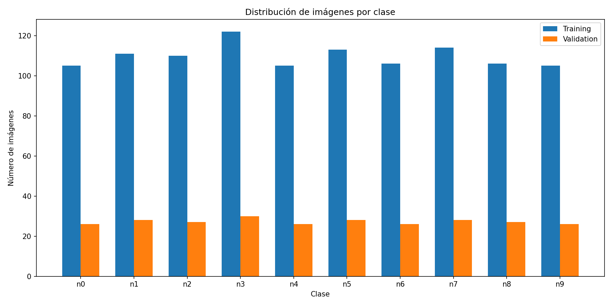
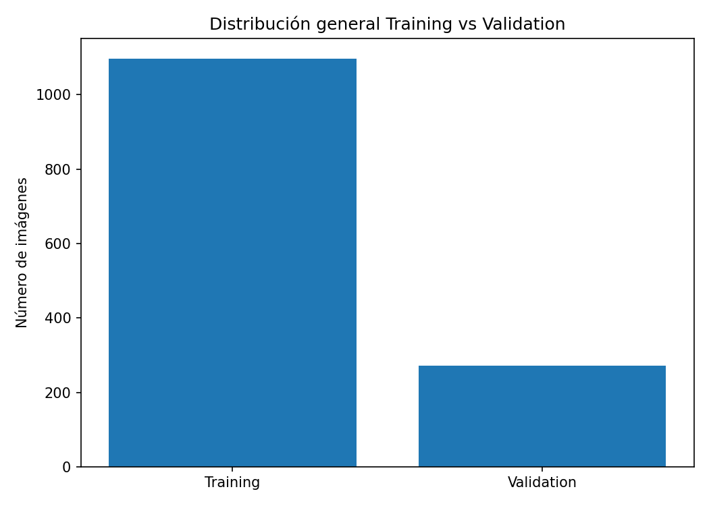
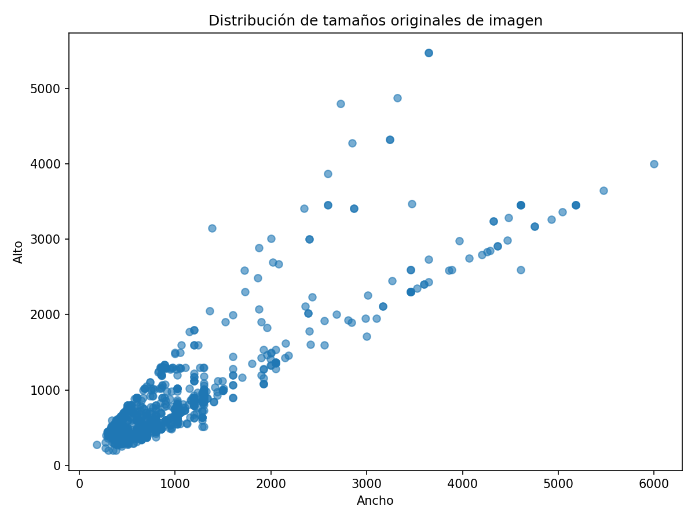
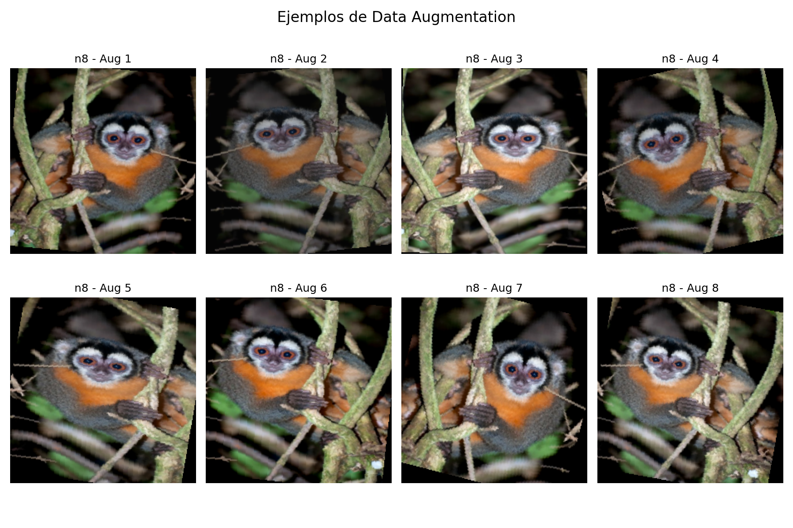
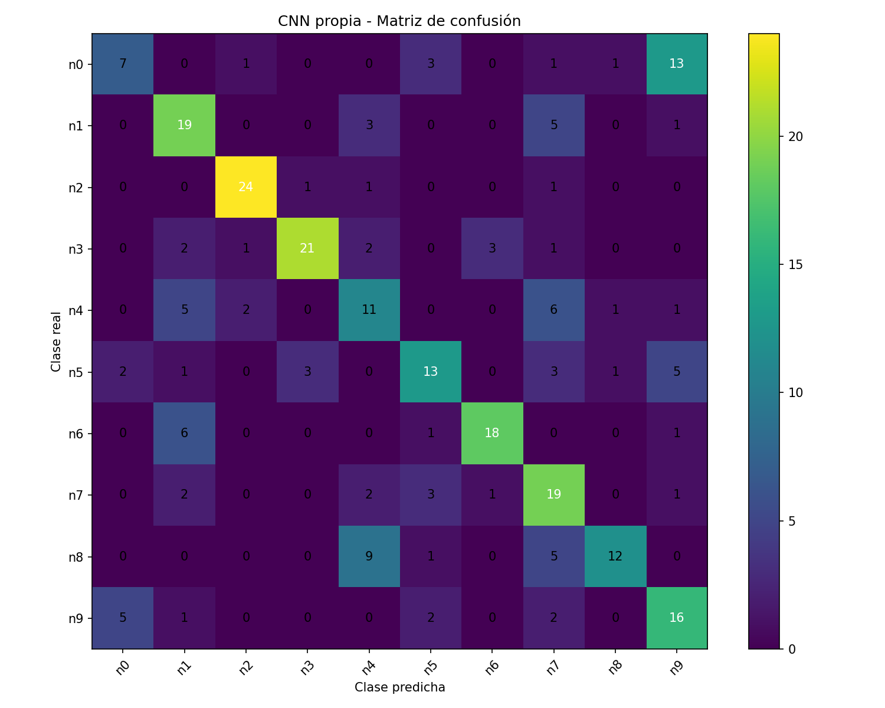
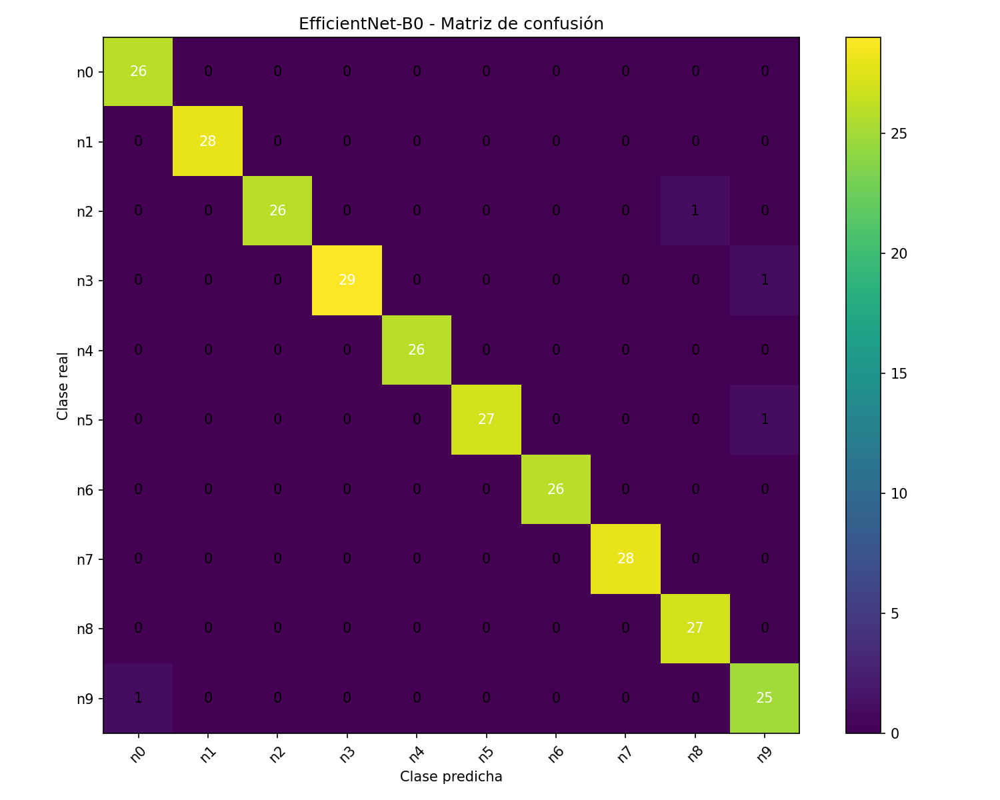

# Reporte Técnico

# Clasificador de especies de monos con producto IA desplegado

## 1. Resumen ejecutivo

Este proyecto desarrolla una solución completa de inteligencia artificial para clasificación multiclase de imágenes de especies de monos, utilizando el dataset **10 Monkey Species** de Kaggle.

La solución no se limita al entrenamiento de una red neuronal, sino que implementa un producto funcional de extremo a extremo, compuesto por:

* Análisis exploratorio del dataset.
* Preprocesamiento y data augmentation.
* Entrenamiento de una CNN propia.
* Entrenamiento con transfer learning usando EfficientNet-B0.
* Evaluación con métricas completas.
* API de inferencia con FastAPI.
* Frontend web con React.
* Dockerización.
* Despliegue público en Google Cloud Run.

El modelo final seleccionado fue **EfficientNet-B0**, debido a que obtuvo el mejor desempeño en validación, con un **Accuracy de 0.9853**, **Macro F1-score de 0.9852** y **Top-3 Accuracy de 1.0000**.

---

## 2. Objetivo del proyecto

El objetivo general del proyecto es construir un sistema de clasificación de imágenes capaz de identificar una imagen de mono dentro de una de las 10 especies disponibles en el dataset **10 Monkey Species**.

Además del entrenamiento del modelo, el proyecto busca demostrar capacidades de ingeniería para llevar el modelo a un producto funcional, incluyendo backend, frontend, Docker y despliegue en la nube.

La prueba técnica solicita explícitamente entrenamiento, evaluación, persistencia del modelo, backend de inferencia, frontend web y despliegue público.

---

## 3. Dataset utilizado

El dataset utilizado fue:

**10 Monkey Species - Kaggle**

URL:

```txt
https://www.kaggle.com/datasets/slothkong/10-monkey-species
```

El dataset contiene imágenes JPEG organizadas en carpetas de entrenamiento y validación. Las clases están etiquetadas desde `n0` hasta `n9`.

| Label | Nombre científico     | Nombre común              |
| ----- | --------------------- | ------------------------- |
| n0    | alouatta_palliata     | mantled_howler            |
| n1    | erythrocebus_patas    | patas_monkey              |
| n2    | cacajao_calvus        | bald_uakari               |
| n3    | macaca_fuscata        | japanese_macaque          |
| n4    | cebuella_pygmea       | pygmy_marmoset            |
| n5    | cebus_capucinus       | white_headed_capuchin     |
| n6    | mico_argentatus       | silvery_marmoset          |
| n7    | saimiri_sciureus      | common_squirrel_monkey    |
| n8    | aotus_nigriceps       | black_headed_night_monkey |
| n9    | trachypithecus_johnii | nilgiri_langur            |

---

## 4. Análisis exploratorio del dataset

Durante el análisis exploratorio se validó la estructura del dataset y se calcularon las cantidades de imágenes por partición.

| Partición  | Número de imágenes |
| ---------- | -----------------: |
| Training   |               1097 |
| Validation |                272 |
| Total      |               1369 |

### 4.1 Distribución por clase

El dataset presenta una distribución relativamente balanceada entre clases, aunque existen pequeñas variaciones en la cantidad de imágenes disponibles para cada especie.

**Figura 1. Distribución de imágenes por clase.**



**Figura 2. Distribución general entre entrenamiento y validación.**



### 4.2 Ejemplos visuales por clase

Se generó una visualización con ejemplos por clase para inspeccionar las características visuales del dataset.

**Figura 3. Ejemplos visuales por clase.**


### 4.3 Tamaños originales de imagen

Las imágenes tienen resoluciones variables. Se observaron ejemplos con tamaños como:

```txt
550x367
1920x1080
4267x2911
2560x1600
```

Esta variabilidad justifica el redimensionamiento previo al entrenamiento.

**Figura 4. Distribución de tamaños originales de imagen.**



### 4.4 Problemas potenciales identificados

Durante el análisis se identificaron los siguientes riesgos:

* Dataset pequeño para entrenamiento profundo desde cero.
* Posible overfitting.
* Variabilidad en fondos, iluminación y encuadres.
* Similitud visual entre algunas especies.
* Diferentes resoluciones de imagen.
* Necesidad de data augmentation para mejorar generalización.

---

## 5. Preprocesamiento y data augmentation

El pipeline de preprocesamiento fue implementado en:

```txt
src/training/preprocessing.py
```

### 5.1 Transformaciones para entrenamiento

Para entrenamiento se aplicaron transformaciones orientadas a reducir overfitting:

* Resize inicial a `256x256`.
* RandomResizedCrop a `224x224`.
* RandomHorizontalFlip.
* RandomRotation.
* ColorJitter para brillo, contraste y saturación.
* Conversión a tensor.
* Normalización con medias y desviaciones estándar de ImageNet.

### 5.2 Transformaciones para validación e inferencia

Para validación e inferencia no se aplicó data augmentation, con el fin de evaluar el modelo sobre imágenes estables:

* Resize a `256x256`.
* CenterCrop a `224x224`.
* Conversión a tensor.
* Normalización con medias y desviaciones estándar de ImageNet.

### 5.3 Evidencia visual de data augmentation

**Figura 5. Ejemplos de data augmentation aplicado sobre una imagen del dataset.**



Este paso permite que el modelo vea variaciones de una misma imagen durante el entrenamiento, ayudando a mejorar la generalización.

---

## 6. Modelo 1: CNN propia

Se implementó una red neuronal convolucional propia como baseline obligatorio del proyecto.

Archivo:

```txt
src/training/train_cnn.py
```

### 6.1 Arquitectura general

La CNN propia incluye:

* Bloques `Conv2D`.
* `BatchNorm2D`.
* Activación `ReLU`.
* `MaxPooling`.
* `Dropout`.
* Capas fully connected.
* Capa final de salida para 10 clases.

### 6.2 Justificación

La CNN propia se entrenó para cumplir el requisito técnico de construir una red convolucional desde cero y para establecer una línea base contra la cual comparar modelos más avanzados.

No se optimizó agresivamente con muchas épocas adicionales porque el dataset es pequeño y existía riesgo de overfitting. Se decidió mantenerla como baseline reproducible y luego comparar contra transfer learning.

### 6.3 Resultados de la CNN propia

| Métrica         |  Valor |
| --------------- | -----: |
| Accuracy        | 0.5882 |
| Precision Macro | 0.6164 |
| Recall Macro    | 0.5855 |
| Macro F1-score  | 0.5854 |
| Top-3 Accuracy  | 0.8676 |

### 6.4 Principales confusiones

| Clase real | Clase predicha | Cantidad |
| ---------- | -------------- | -------: |
| n0         | n9             |       13 |
| n8         | n4             |        9 |
| n4         | n7             |        6 |
| n6         | n1             |        6 |
| n1         | n7             |        5 |

**Figura 6. Matriz de confusión de la CNN propia.**



### 6.5 Interpretación

La CNN propia logró aprender patrones visuales relevantes, pero su desempeño fue limitado debido a:

* Tamaño reducido del dataset.
* Similitud visual entre especies.
* Alta variabilidad en fondos y poses.
* Entrenamiento desde cero sin conocimiento visual previo.

Sin embargo, el Top-3 Accuracy de 0.8676 indica que el modelo frecuentemente incluía la clase correcta dentro de sus tres predicciones principales.

---

## 7. Modelo 2: EfficientNet-B0 con transfer learning

Se entrenó un segundo modelo utilizando transfer learning con **EfficientNet-B0** preentrenado en ImageNet.

Archivo:

```txt
src/training/train_transfer.py
```

### 7.1 Estrategia aplicada

La estrategia consistió en:

* Cargar EfficientNet-B0 con pesos preentrenados.
* Reemplazar la capa clasificadora final.
* Ajustar la salida a 10 clases.
* Congelar inicialmente el extractor de características.
* Liberar parcialmente los últimos bloques para fine-tuning.
* Seleccionar el mejor checkpoint usando Macro F1 en validación.

### 7.2 Justificación

EfficientNet-B0 fue seleccionado porque es un modelo eficiente, con buen desempeño en clasificación de imágenes y adecuado para escenarios donde el dataset es pequeño.

Al usar pesos preentrenados en ImageNet, el modelo aprovecha características visuales generales como bordes, texturas, formas y composiciones, reduciendo la necesidad de aprender todo desde cero.

---

## 8. Evaluación del modelo final

El modelo final fue evaluado con:

* Accuracy.
* Precision macro.
* Recall macro.
* Macro F1-score.
* Top-3 Accuracy.
* Classification report por clase.
* Matriz de confusión.

Archivo:

```txt
src/training/evaluate_transfer.py
```

### 8.1 Métricas generales

| Métrica         |  Valor |
| --------------- | -----: |
| Accuracy        | 0.9853 |
| Precision Macro | 0.9853 |
| Recall Macro    | 0.9855 |
| Macro F1-score  | 0.9852 |
| Top-3 Accuracy  | 1.0000 |

### 8.2 Métricas por clase

| Clase | Precision | Recall | F1-score | Support |
| ----- | --------: | -----: | -------: | ------: |
| n0    |    0.9630 | 1.0000 |   0.9811 |      26 |
| n1    |    1.0000 | 1.0000 |   1.0000 |      28 |
| n2    |    1.0000 | 0.9630 |   0.9811 |      27 |
| n3    |    1.0000 | 0.9667 |   0.9831 |      30 |
| n4    |    1.0000 | 1.0000 |   1.0000 |      26 |
| n5    |    1.0000 | 0.9643 |   0.9818 |      28 |
| n6    |    1.0000 | 1.0000 |   1.0000 |      26 |
| n7    |    1.0000 | 1.0000 |   1.0000 |      28 |
| n8    |    0.9643 | 1.0000 |   0.9818 |      27 |
| n9    |    0.9259 | 0.9615 |   0.9434 |      26 |

### 8.3 Principales confusiones

| Clase real | Clase predicha | Cantidad |
| ---------- | -------------- | -------: |
| n2         | n8             |        1 |
| n3         | n9             |        1 |
| n5         | n9             |        1 |
| n9         | n0             |        1 |

**Figura 7. Matriz de confusión de EfficientNet-B0.**



### 8.4 Interpretación

EfficientNet-B0 presentó un desempeño significativamente superior a la CNN propia. El modelo cometió pocos errores y alcanzó un Top-3 Accuracy perfecto sobre el conjunto de validación.

Aun así, las métricas altas deben interpretarse con cautela porque el dataset es pequeño y la validación proviene del mismo dataset original de Kaggle.

---

## 9. Comparación de modelos

| Modelo          | Accuracy | Macro F1-score | Top-3 Accuracy |
| --------------- | -------: | -------------: | -------------: |
| CNN propia      |   0.5882 |         0.5854 |         0.8676 |
| EfficientNet-B0 |   0.9853 |         0.9852 |         1.0000 |

### 9.1 Modelo seleccionado

El modelo seleccionado para inferencia y despliegue fue:

```txt
EfficientNet-B0
```

### 9.2 Justificación de selección

EfficientNet-B0 fue seleccionado porque:

* Superó ampliamente a la CNN propia.
* Alcanzó mejor Accuracy y Macro F1-score.
* Logró Top-3 Accuracy de 1.0000.
* Es más adecuado para datasets pequeños.
* Aprovecha conocimiento visual preentrenado.
* Es eficiente para despliegue en servicios web.

---

## 10. Inferencia local

Se implementó un módulo de inferencia local en:

```txt
src/inference/predict.py
```

Este módulo permite cargar el checkpoint final y ejecutar predicciones sobre imágenes individuales.

Ejemplo de ejecución:

```bash
python -m src.inference.predict --image "data/raw/validation/validation/n3/n300.jpg"
```

Ejemplo de salida:

```json
{
  "predicted_label": "n3",
  "scientific_name": "macaca_fuscata",
  "common_name": "japanese_macaque",
  "confidence": 0.9084,
  "top_predictions": [
    {
      "label": "n3",
      "scientific_name": "macaca_fuscata",
      "common_name": "japanese_macaque",
      "confidence": 0.9084
    },
    {
      "label": "n2",
      "scientific_name": "cacajao_calvus",
      "common_name": "bald_uakari",
      "confidence": 0.0496
    },
    {
      "label": "n1",
      "scientific_name": "erythrocebus_patas",
      "common_name": "patas_monkey",
      "confidence": 0.0258
    }
  ]
}
```

---

## 11. Backend de inferencia

El backend fue desarrollado con **FastAPI**.

Archivo principal:

```txt
backend/main.py
```

### 11.1 Endpoints implementados

| Método | Endpoint      | Descripción                       |
| ------ | ------------- | --------------------------------- |
| GET    | `/`           | Información básica del servicio   |
| GET    | `/health`     | Estado del servicio               |
| GET    | `/model-info` | Información del modelo cargado    |
| POST   | `/predict`    | Predicción a partir de una imagen |

### 11.2 Funcionamiento

El backend carga el modelo una sola vez al iniciar el servicio. Esto evita cargar el modelo en cada petición y mejora el tiempo de respuesta.

El endpoint `/predict`:

1. Recibe una imagen.
2. Valida formato y tamaño.
3. Guarda temporalmente la imagen.
4. Ejecuta inferencia usando EfficientNet-B0.
5. Retorna JSON con predicción, confianza y Top-3 clases.
6. Elimina el archivo temporal.

### 11.3 Ejemplo de respuesta

```json
{
  "predicted_label": "n4",
  "scientific_name": "cebuella_pygmea",
  "common_name": "pygmy_marmoset",
  "confidence": 0.9211,
  "top_predictions": [
    {
      "label": "n4",
      "scientific_name": "cebuella_pygmea",
      "common_name": "pygmy_marmoset",
      "confidence": 0.9211
    },
    {
      "label": "n7",
      "scientific_name": "saimiri_sciureus",
      "common_name": "common_squirrel_monkey",
      "confidence": 0.0165
    },
    {
      "label": "n1",
      "scientific_name": "erythrocebus_patas",
      "common_name": "patas_monkey",
      "confidence": 0.016
    }
  ]
}
```

## 12. Frontend web

El frontend fue desarrollado con **React + Vite**.

Carpeta:

```txt
frontend/
```

### 12.1 Funcionalidades implementadas

La interfaz permite:

* Subir una imagen.
* Validar formato JPG, JPEG o PNG.
* Mostrar vista previa.
* Consultar el estado del backend.
* Enviar la imagen al endpoint `/predict`.
* Mostrar especie predicha.
* Mostrar nombre científico.
* Mostrar porcentaje de confianza.
* Mostrar Top-3 predicciones.
* Mostrar respuesta JSON.
* Mostrar errores de validación o conexión.

---

## 13. Dockerización

La solución fue dockerizada con dos contenedores principales:

| Servicio               | Archivo Docker        |                         Puerto |
| ---------------------- | --------------------- | -----------------------------: |
| Backend FastAPI        | `backend/Dockerfile`  | 8080 en Cloud Run / 8000 local |
| Frontend React + Nginx | `frontend/Dockerfile` | 8080 en Cloud Run / 3000 local |

También se creó:

```txt
docker-compose.yml
```

### 13.1 Ejecución local con Docker Compose

Desde la raíz del proyecto:

```bash
docker compose up --build
```

Servicios disponibles:

| Servicio | URL                                            |
| -------- | ---------------------------------------------- |
| Backend  | [http://localhost:8000](http://localhost:8000) |
| Frontend | [http://localhost:3000](http://localhost:3000) |

Para detener:

```bash
docker compose down
```

---

## 14. Despliegue en Google Cloud Run

La solución fue desplegada en Google Cloud Run usando dos servicios separados:

| Servicio                  | Descripción                            |
| ------------------------- | -------------------------------------- |
| `monkey-species-backend`  | API FastAPI con modelo EfficientNet-B0 |
| `monkey-species-frontend` | Aplicación React servida con Nginx     |

### 14.1 URL pública del backend

```txt
https://monkey-species-backend-992637477682.us-east1.run.app
```

### 14.2 URL pública del frontend

```txt
https://monkey-species-frontend-992637477682.us-east1.run.app
```

### 14.3 Pruebas realizadas en Cloud Run

Se validó que:

* `/health` responde correctamente.
* `/model-info` devuelve información del modelo.
* `/predict` recibe imágenes y retorna predicciones.
* El frontend público consume el backend público.
* El usuario puede cargar una imagen desde navegador y visualizar el resultado.

---

## 15. Limitaciones

Aunque el resultado final fue alto, se identifican las siguientes limitaciones:

* El dataset contiene menos de 1.400 imágenes.
* La validación proviene del mismo dataset original de Kaggle.
* No se cuenta con un test set externo independiente.
* Puede existir diferencia entre imágenes del dataset e imágenes reales de usuarios.
* Las métricas pueden ser optimistas por el tamaño del dataset.
* No se implementó monitoreo continuo de predicciones.
* No se implementó autenticación para el endpoint público.

---

## 16. Mejoras futuras

Para llevar esta solución a un entorno productivo más robusto, se recomienda:

1. Construir un conjunto de test externo.
2. Validar el modelo con imágenes reales adicionales.
3. Implementar monitoreo de confianza y errores.
4. Registrar predicciones de baja confianza.
5. Agregar versionamiento formal de modelos.
6. Automatizar entrenamiento y despliegue con CI/CD.
7. Implementar autenticación si el servicio requiere control de acceso.
8. Usar almacenamiento externo para modelos, por ejemplo Cloud Storage.
9. Agregar pruebas unitarias e integración.
10. Optimizar el modelo para inferencia, por ejemplo con ONNX o TorchScript.

---

## 17. Conclusiones

El proyecto logró construir una solución completa de inteligencia artificial para clasificación de especies de monos.

Se implementó una CNN propia como baseline técnico y posteriormente se entrenó EfficientNet-B0 con transfer learning, logrando una mejora significativa en desempeño.

El modelo final fue integrado en un backend FastAPI, consumido desde un frontend React, dockerizado y desplegado públicamente en Google Cloud Run.

La solución cumple con los principales criterios técnicos de un producto IA desplegado:

* Modelo entrenado.
* Evaluación completa.
* Modelo serializado.
* Inferencia local.
* API funcional.
* Interfaz web.
* Dockerización.
* Despliegue público.
* Documentación técnica.

---

## 18. Anexos

### Archivos principales del proyecto

```txt
src/training/eda.py
src/training/preprocessing.py
src/training/train_cnn.py
src/training/evaluate_cnn.py
src/training/train_transfer.py
src/training/evaluate_transfer.py
src/inference/predict.py
backend/main.py
frontend/src/App.jsx
docker-compose.yml
README.md
```

### Reportes generados

```txt
reports/eda_report.md
reports/cnn_classification_report.md
reports/transfer_classification_report.md
reports/model_comparison.md
reports/technical_report.md
```

### Figuras generadas

```txt
reports/class_distribution.png
reports/train_validation_distribution.png
reports/sample_images_by_class.png
reports/image_sizes_distribution.png
reports/data_augmentation_examples.png
reports/cnn_confusion_matrix.png
reports/transfer_confusion_matrix.png
```
